# **Immo_Eliza**
### **Data Analysis**
**Repository:** [challenge-data-analysis](https://github.com/ManelBouba/immo_eliza_analysis)  
**Type of Challenge:** Consolidation  
**Duration:** 3 days  
**Deadline:** 22/11/2024 12:30  
**Team Size:** 3  

## Table of Contents
1. [The Mission](#the-mission)
2. [Installation](#installation)
3. [Usage](#usage)
4. [Deliverables](#deliverables)
5. [Team](#team)

## The Mission
We are continuing our journey to create a machine learning model that predicts property prices in Belgium. In this phase, we focus on conducting a preliminary data analysis to gather meaningful insights.  
We will use the previously scraped dataset, clean the data, and perform the analysis.

## Installation
### Project Directory Structure

```plaintext
immo-eliza-analysis/
├── asset/                                     # Folder containing files for graphs visualizations
├── Data/                                      # Folder containing all datasets
├── map/                                       # Folder containing files for map visualizations
│   ├── immoweb_data.csv                       # Raw dataset
│   ├── immoweb_data_cleaned.csv               # Cleaned dataset
│   ├── immoweb_data_filtred.csv               # Filtered dataset
│   ├── encoded_data.csv                       # Encoded dataset
├── dashboard.py                               # Build and run dashboard
├── Data_Analysis.py                           # Run analysis on the cleaned data
├── Data_Cleaning.py                           # Run cleaning on raw immoweb_data.csv
├── README.md                                  # Project overview and instructions
├── real_estate_data_analysis.ipynb            # Jupyter notebook for data analysis
├── real_estate_data_cleaning.ipynb            # Jupyter notebook for data cleaning
```

### Clone the Repository

To get started, clone the repository:

```bash
git clone https://github.com/ManelBouba/immo_eliza_analysis
```

## Usage

To run the project, follow the steps below:

1) **Data Cleaning**:  
   Run `Data_Cleaning.py` to clean the raw data (`immoweb_data.csv`) and save the cleaned dataset as `immoweb_data_cleaned.csv`.

2) **Data Analysis**:  
   After cleaning the data, run `Data_Analysis.py` to analyze the cleaned data and generate insights.

3) **Dashboard**:  
   Use `dashboard.py` to create a visualization dashboard by running:
   
   ```bash
   streamlit run dashboard.py
   ```

   This will start a local server and allow you to interact with the data via an interactive dashboard.

## Deliverables

### **Step 1: Data Cleaning**

The detailed explanation of the Data Cleaning process is in the Jupyter notebook **real_estate_data_cleaning.ipynb**, contributed by [LAI Edoardo](https://www.linkedin.com/in/edoardo-lai/).

- **Loaded and explored** the dataset.
- **Identified and visualized** missing values.
- **Identified critical columns** to keep and drop, with explanations.
- **Handled missing values** by imputing data based on grouped analysis.
- **Categorized variables** to make them easier for analysis.
- **Removed outliers** and visualized their impact through histograms and boxplots.
- **Prepared data** for future modeling tasks.

### **Step 2: Data Analysis**

The detailed explanation of Data Analysis is in the Jupyter notebook **real_estate_data_analysis.ipynb**, contributed by [BOUBAKEUR Manel](https://www.linkedin.com/in/boubakeur-manel-52679a159/).

- **Dataset Overview**: The dataset has 16 columns and 16,631 rows.
- **Correlation Analysis**:
  - The strongest correlations with property price are:
    - `Living Area (0.43)`
    - `Number of Rooms (0.33)`
  - The weakest correlations with price are:
    - `Lift (0.02)`
    - `Type of Property (0.02)`
    - `Swimming Pool (0.03)`
    - `Garden (0.04)`

- **Qualitative and Quantitative Variables**:
  - We analyzed both types of variables and discussed the transformation of qualitative variables into numerical values for analysis.

### **Step 3: Data Interpretation**

In this step, the analysis was communicated through tables and graphs by [BOUBAKEUR Manel](https://www.linkedin.com/in/boubakeur-manel-52679a159/) and [FOMICHOV Andrii](https://www.linkedin.com/in/andrii-fomichov-73928642/).

#### Key Findings:

1. **Strong Positive Correlations**:
   - `Type_of_Property ↔ Subtype_of_Property (0.71)`
   - `Living_Area ↔ Number_of_Rooms (0.72)`
   - `Surface_area_plot_of_land ↔ Type_of_Property (0.73)`
   
2. **Moderate Positive Correlations**:
   - `Number_of_Rooms ↔ Type_of_Property (0.57)`
   - `Living_Area ↔ Type_of_Property (0.60)`
   
3. **Weak Positive Correlations**:
   - `Fully_Equipped_Kitchen ↔ State_of_the_Building (0.25)`
   - `Terrace ↔ Fully_Equipped_Kitchen (0.15)`

4. **Price vs Property Analysis**:
   - The price distribution and mean values were plotted, identifying the most common price bins and the distribution across different types of properties.

   
   The price distribution shows a significant number of observations in the price range of 300,000 to 400,000 euros.

5. **Price by Municipality**:
   - The analysis of municipalities helped identify the most and least expensive areas in Belgium, Wallonia, and Flanders.
   
   **Most Expensive Municipality (Belgium)**:  
   - **Knokke-Heist**: Average Price = 601,451.55 EUR | Price per sqm = 7,464.10 EUR
   
   **Least Expensive Municipality (Belgium)**:  
   - **Vaux-sur-Sûre**: Average Price = 125,000.00 EUR | Price per sqm = 657.89 EUR

   The full breakdown for Wallonia and Flanders is provided in the project.
   
## Graphs

Here are the visualizations related to the project:

- **Correlation Heatmap for Apartment**
  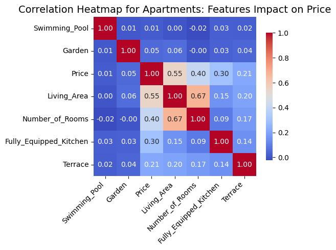

- **Correlation Heatmap for Houses**
  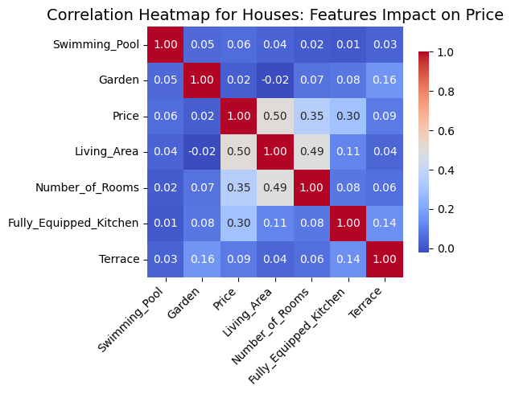

- **Distribution of Property Prices**
  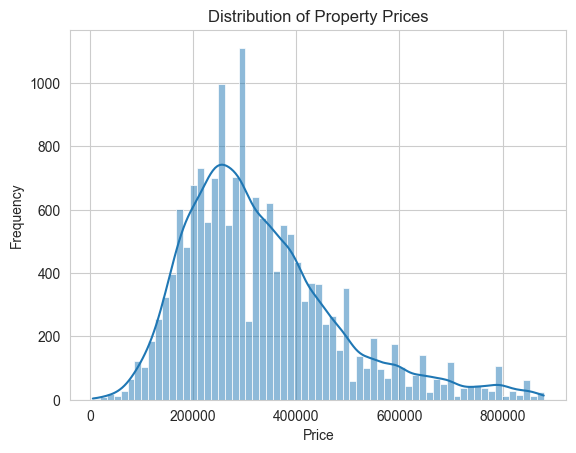

- **Heatmap of Variable Correlations**
  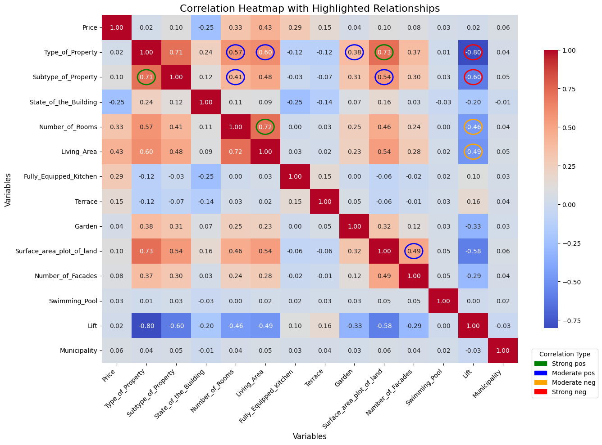

- **Heatmap of Correlation Between Variables and Price**
  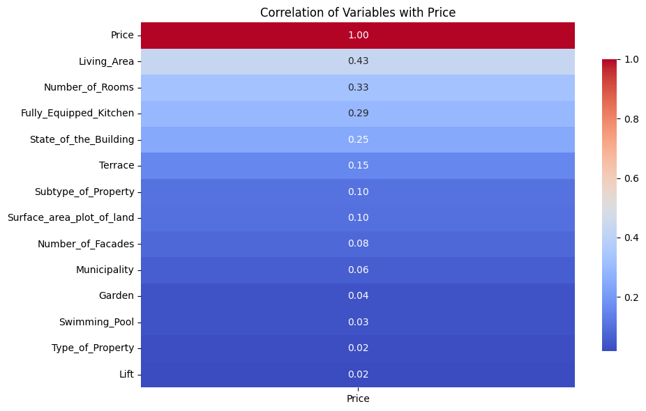

- **Number of Properties by Location**
  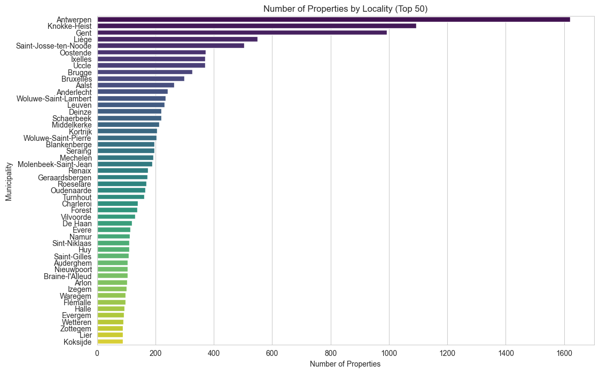

- **Number of Properties by Province**
  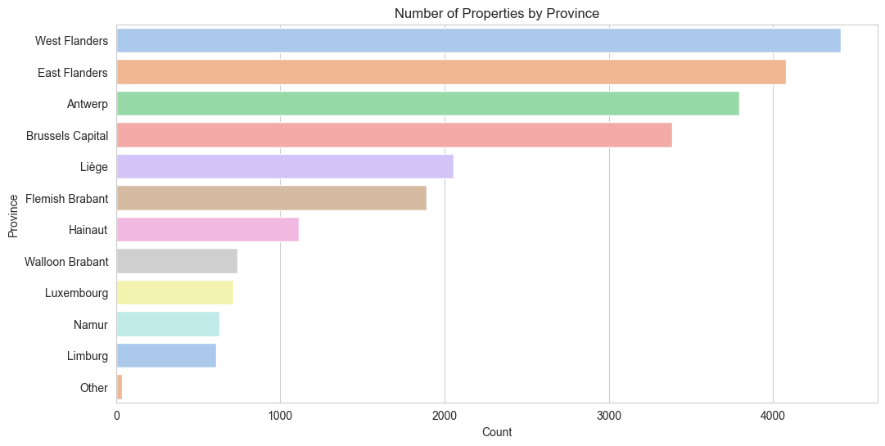

- **Outliers**
  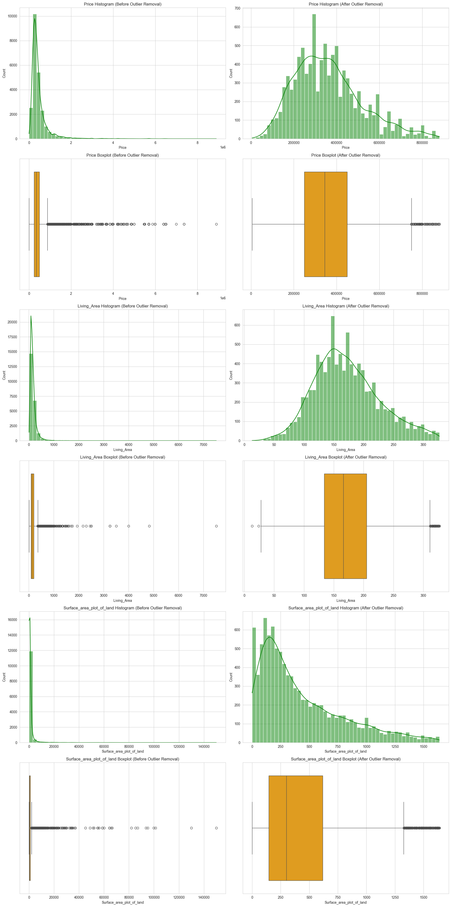

- **Percentage of Missing Values**
  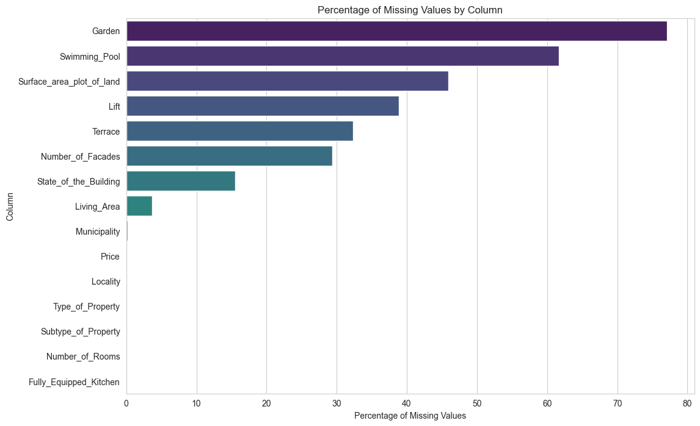

- **Price vs Area**
  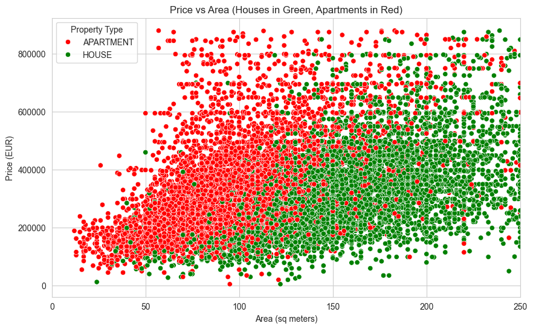

- **Price for Apartments**
  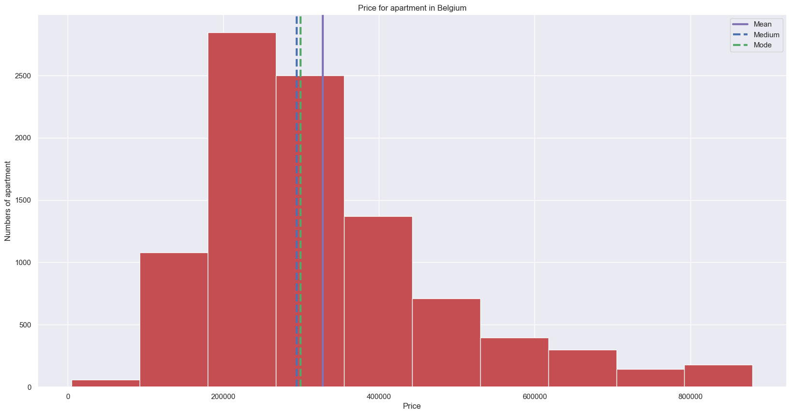

- **Price for Houses**
  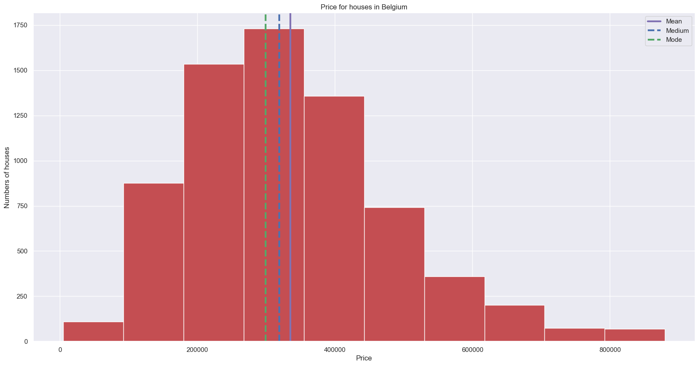

- **Price for Properties**
  

- **Properties Price Distribution**
  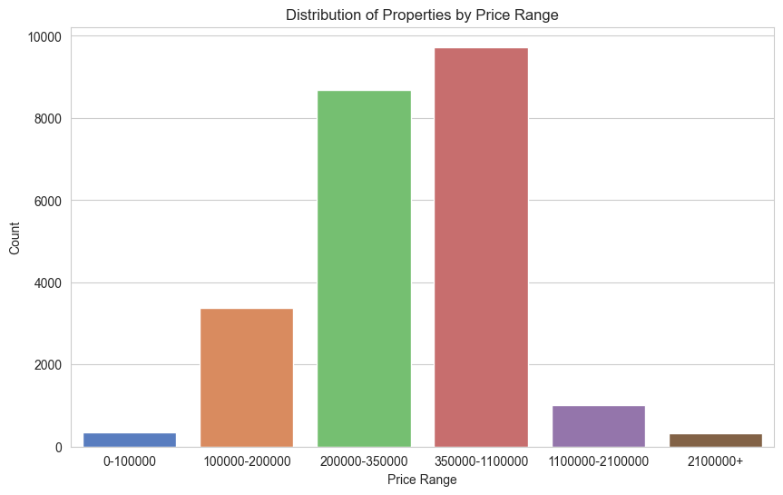

## Contributors

- **[BOUBAKEUR Manel](https://www.linkedin.com/in/boubakeur-manel-52679a159/)** – Data Analyst & Developer
- **[LAI Edoardo](https://www.linkedin.com/in/edoardo-lai/)** – Data Cleaning & Preprocessing
- **[FOMICHOV Andrii](https://www.linkedin.com/in/andrii-fomichov-73928642/)** – Data Visualization & Interpretation

