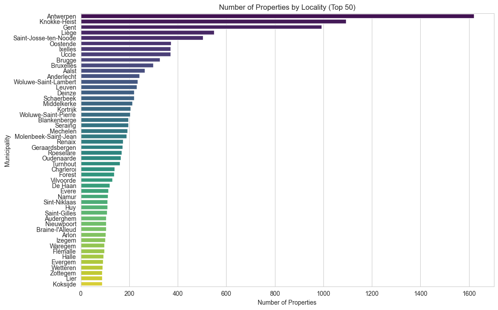

## **Immo_Eliza**
### **Data Analysis**
**Repository:** challenge-data-analysis  
**Type of Challenge:** Consolidation  
**Duration:** 3 days  
**Deadline:** 22/11/2024 12:30  
**Team challenge:** 3  

## Table of Contents
1. [The Mission](#The-Mission)
2. [Installation](#Installation)
3. [Usage](#usage)
4. [Deliverables](#deliverables)
5. [Team](#team)

## The Mission
We are continuing our path for creation a machine learning model to predict prices on Belgium’s sales.  
In this step we need to do a preliminary analysis to gather some information.  
So we have to take the dataset previously scraped to do the analysis and clean it.

## Installation
### Project Directory Structure NEED TO FINALIZE!!!!!!!!!!!!!!!!!!!!!!!!!!!!

```plaintext

immo-eliza/
├──  1.immo_eliza_scraping.md                   # The main task  from BeCode
├── README.md                                   # Project overview and instructions
├── Data_Analysis.py                            # Run analyzing
├── Data_Cleaning.py                            # Run cleaning
├── dashboard.py                                # Run building dashboard
├── real_estate_data_analysis.ipynb             # Notebook for data analysis
├── real_estate_data_cleaning.ipynb             # Notebook for data cleaning
├── immoweb_data_cleaned.csv                    # Cleaned data
assets/                                         # Visualizations
```

# Installation
## Clone the repository (bash):

git clone https://github.com/ManelBouba/immo_eliza_analysis

## Usage NEED TO FINALIZE!!!!!!!!!!!!!!!!!!!!!!!!!!!!

To start the program, run:
1) Data_Cleaning.py - for run cleaning data immoweb_data.csv and save cleaned data in immoweb_data_cleaned.csv
2) Data_Analysis.py - for run analyzing the cleaned data 
3) dashboard.py - to run building dashboards by: streamlit run dashboard.py from the terminal

## Deliverables
### **Step 1 : Data Cleaning**
The detailed explanation of Data Cleaning is in the **real_estate_data_cleaning.ipynb**, Notebook by contributor LAI Edoardo.

### **Conclusion for Data Cleaning**
• Loaded and explored the dataset.  
• Analyzed and visualized missing values.  

  

• Identified critical columns and columns to drop, with explanations.  
• Handled missing values appropriately, including imputations based on grouped data.  
• Categorized data to facilitate better imputation and analysis.  

  

  

  

• Made deductions based on data patterns to fill missing values logically.  
• Removed outliers and visualized their impact using both histograms and boxplots.  

  

• Prepared the dataset for future modeling tasks.  

### **Step 2 : Data Analysis**
The detailed explanation of Data Analyzing is in the **real_estate_data_analysis.ipynb**, Notebook by contributor BOUBAKEUR Manel.  
1. How many rows and columns?  
There are 16631 rows in  16 columns.  
2. What is the correlation between the variables and the price? (Why might that be?)  
3. How are variables correlated to each other? (Why?)  
4. How are variables correlated to each other? (Why?)  
5. Which variables have the greatest influence on the price?  
6. Which variables have the least influence on the price?
   
 

We can see the strongest influence on Living Area (0.43) and followed by Number of Rooms (0.33) with the price.  
We can see the weakest influence on variables like Lift (0.02) and type of property (0.02) with the prices.  
We can find surprisingly weak relationships. The features like Swimming_Pool (0.03) and Garden (0.04) show weaker-than-expected correlations, possibly due to their infrequency or overlap with other features.  
8. How many qualitative and quantitative variables are there? How would you transform these values into numerical values?  
9. Percentage of missing values per column?  

### **Step 3 : Data Interpretation**
Here contributors BOUBAKEUR Manel and FOMICHOV Andrii communicate analysis using tables and graphs.  
The interpretation of the correlations provided between Price and the respective variables.  

  

1_Strong Positive Correlations (Above 0.5): Type_of_Property ↔ Subtype_of_Property (0.71): Subtypes align strongly with property types. Living_Area ↔ Number_of_Rooms (0.72): Larger living areas are strongly linked to more rooms. Surface_area_plot_of_land ↔ Type_of_Property (0.73): Larger land plots correspond to specific property types. Surface_area_plot_of_land ↔ Subtype_of_Property (0.54): Subtypes are influenced by plot size.  

2_Moderate Positive Correlations (0.3 to 0.5): Number_of_Rooms ↔ Type_of_Property (0.57): Room count correlates with property type. Living_Area ↔ Type_of_Property (0.60): Certain property types tend to have larger living areas. Garden ↔ Type_of_Property (0.38): Gardens are associated with specific property types. Number_of_Facades ↔ Surface_area_plot_of_land (0.48): Larger land plots are linked to more facades. Number_of_Rooms ↔ Subtype_of_Property (0.41): Subtypes tend to influence room numbers.  

3_Weak Positive Correlations (0.1 to 0.3): Fully_Equipped_Kitchen ↔ State_of_the_Building (0.25): Better building conditions are associated with equipped kitchens. Terrace ↔ Fully_Equipped_Kitchen (0.15): Properties with terraces often have equipped kitchens. Garden ↔ Subtype_of_Property (0.31): Subtypes align with garden availability. Swimming_Pool ↔ Surface_area_plot_of_land (0.04): Pools are slightly more common with larger land plots.  

4-Negligible Positive Correlations (Below 0.1): Municipality ↔ Type_of_Property (0.04): Minimal correlation between municipalities and property types. Lift ↔ Terrace (0.16): A weak association between lifts and terraces.  


In the above histogram we can see that the fourth bin with the price between 300,000 to 400,000 has the most numbers of observation.  
Majority of the observations lie in fourth bin.  
Mean is **330,684**, Median is **299,000** & mode is **299,000** euro.  


In the above histogram we can see that the fourth bin with the price between 300,000 to 400,000 has the most numbers of observation.  
Majority of the observations lie within the second to fifth bin.  
Mean is 334,952, Median is 319,000 & mode is 299,000 euro.


1. Plot the outliers.


2. Which variables would you delete and why ?


3. Represent the number of properties according to their surface using a histogram.


4. In your opinion, which 5 variables are the most important and why?
    - Price  
    - Locality  
    - Living Area  
    - State of the Building  
    - Number of Rooms  
5. What are the most expensive municipalities in Belgium? (Average price, median price, price per square meter)  
6. What are the most expensive municipalities in Wallonia? (Average price, median price, price per square meter)  
7. What are the most expensive municipalities in Flanders? (Average price, median price, price per square meter)  
8. What are the less expensive municipalities in Belgium? (Average price, median price, price per square meter)  
9. What are the less expensive municipalities in Wallonia? (Average price, median price, price per square meter)  
10. What are the less expensive municipalities in Flanders? (Average price, median price, price per square meter)  

| Region    | Municipality           | Type             | Average Price (EUR) | Median Price (EUR) | Price per Square Meter (EUR) |
|-----------|------------------------|------------------|---------------------|--------------------|------------------------------|
| Belgium   | Knokke-Heist           | Most Expensive   | 601,451.55          | 599,000.00         | 7,464.10                     |
| Belgium   | Vaux-sur-Sûre          | Least Expensive  | 125,000.00          | 125,000.00         |   657.89                     |
| Wallonia  | Lasne                  | Most Expensive   | 395,000.00          | 395,000.00         | 4,030.61                     |
| Wallonia  | Vaux-sur-Sûre          | Least Expensive  | 125,000.00          | 125,000.00         |   657.89                     |
| Flanders  | Knokke-Heist           | Most Expensive   | 601,451.55          | 599,000.00         | 7,464.10                     |
| Flanders  | Alveringem             | Least Expensive  | 169,000.00          | 169,000.00         |   840.79                     |
| Brussels  | Ixelles                | Most Expensive   | 458,077.52          | 415,000.00         | 4,563.30                     |
| Brussels  | Molenbeek-Saint-Jean   | Least Expensive  | 264,723.60          | 239,000.00         | 2,796.30                     |


## Contributors
List of team members:  
[BOUBAKEUR Manel](https://www.linkedin.com/in/boubakeur-manel-52679a159/)  
[LAI Edoardo](https://www.linkedin.com/in/edoardo-lai/)  
[FOMICHOV Andrii](https://www.linkedin.com/in/andrii-fomichov-73928642/)
